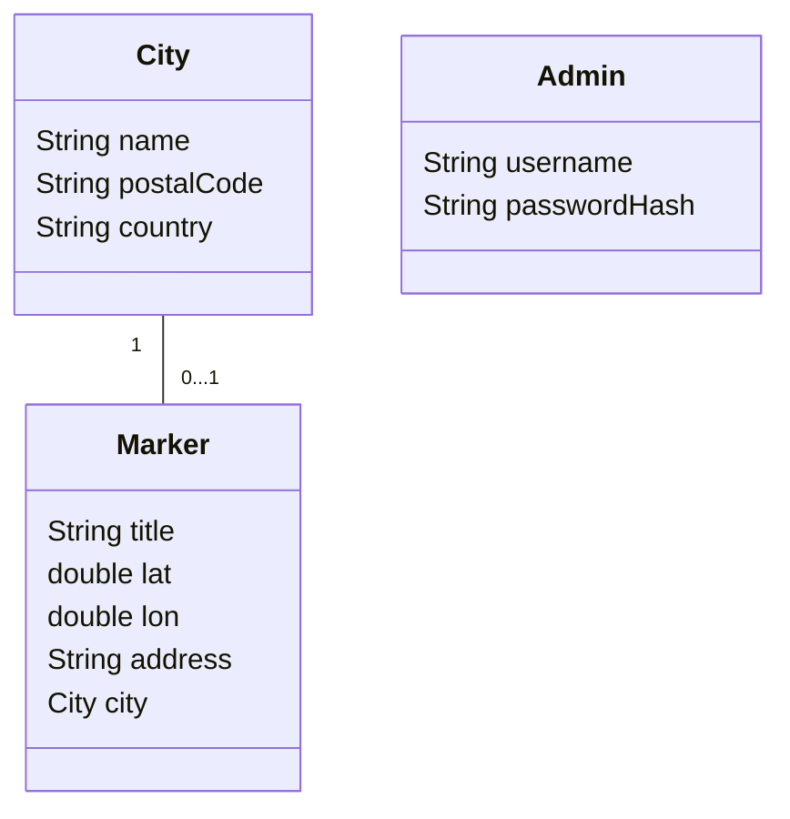

# 5. Building Blocks

## Database

```mermaid
classDiagram
  City "1" -- "0...1" Marker

  class Admin{
    String username
    String passwordHash
  }

  class Marker{
    String title
    double lat
    double lon
    String address
    City city
  }

  class City{
    String name
    String postalCode
    String country
  }
```
